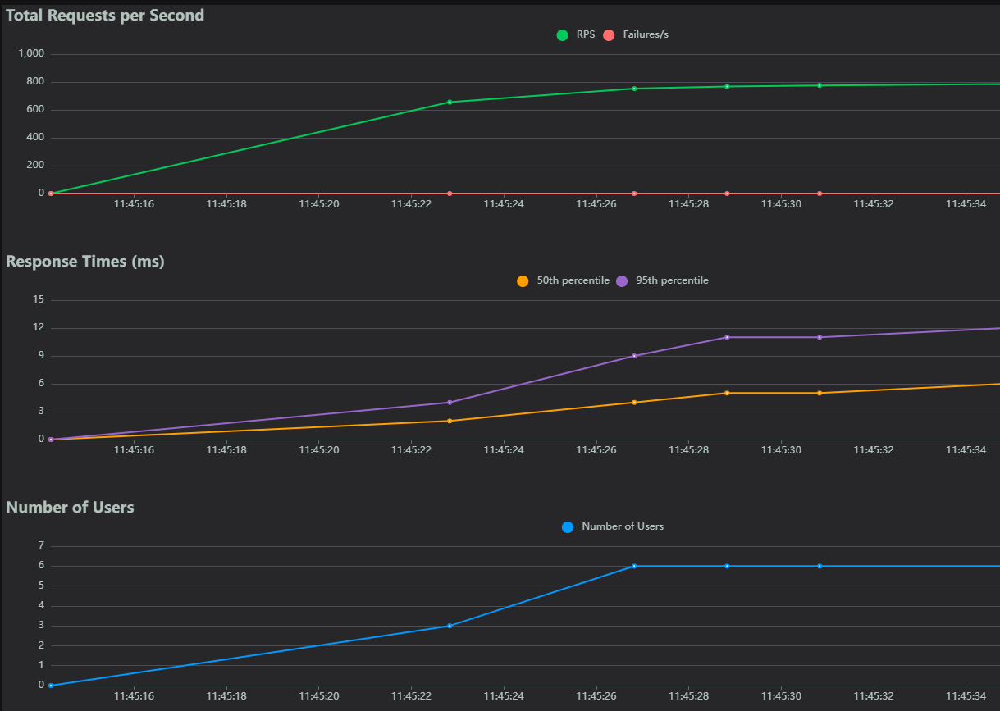
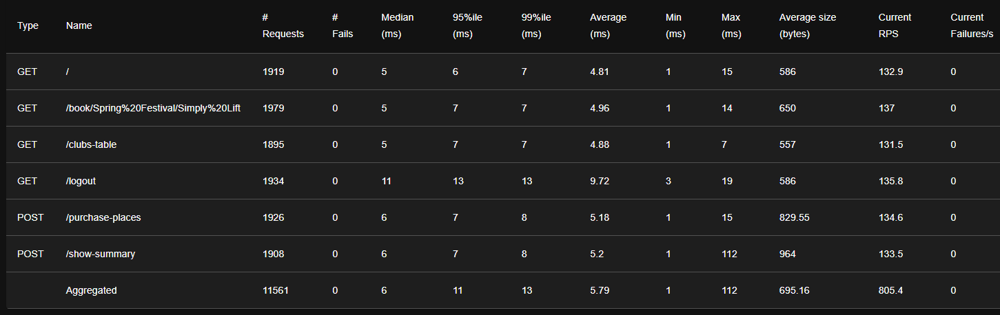
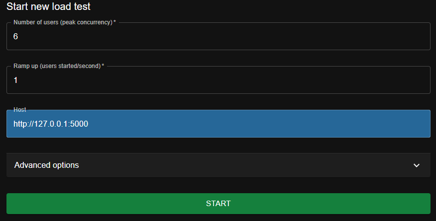
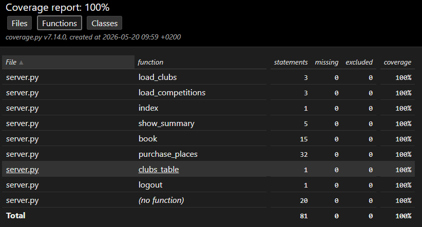

# P11 : Résolution de bugs python

Projet réalisé dans le cadre du développement d'une application pour la société Güdlft.
Il s'agit d'une application permettant coordonner les compétitions de force (deadlifting, strongman) en Amérique du Nord et en Australie.

L'objectif de ce projet est la résolution de bugs bloquants ainsi que l'ajout d'une fonctionnalité de consultation des points des clubs.

---

## Fonctionnalités

- Authentification : connexion d'un club via son adresse email
- Tableau de bord : affichage des compétitions disponibles et des points du club
- Réservation : réservation de places pour une compétition avec les règles suivantes :
  - Maximum 12 places par réservation
  - Impossible de réserver plus de places que le solde de points du club
  - Impossible de réserver plus de places que les places restantes de la compétition
  - Impossible de réserver un nombre négatif de places
- Tableau des clubs : consultation publique des clubs et de leurs points
- Déconnexion : retour à la page d'accueil

---

## Structure du projet

```
P11_Python_Testing/

    readme_img/                             # Répertoire des images pour la documentation
    templates/                              # Répertoire des gabarits html
    tests/                                  # Répertoire de tests
        functionals/                            # tests fonctionnels
        integrations/                           # tests d'intégration
        performance/                            # tests de performance
        units/                                  # tests unitaires
        conftest.py                             # Fichier de configuration des tests
    .coveragerc                             # Fichier de configuration rapport coverage
    .flake8                                 # Fichier de configuraiton rapport flake8
    .gitignore                              # Liste des dossiers et fichiers à ignorer pour le repository
    clubs.json                              # Base de données des clubs (format json)
    competitions.json                       # Base de données des competitions (format json)
    pytest.ini                              # Fichier de configuration rapport pytest
    README.md                               # Documentation
    requirements.txt                        # Liste des dépendances
    server.py                               # Code source de l'application
```

---

## Technologies utilisées 

- Python / Flask : https://flask.palletsprojects.com/en/stable/
- pytest : https://docs.pytest.org/en/stable/
- coverage : https://coverage.readthedocs.io/en/7.14.0/
- locust : https://docs.locust.io/en/stable/
- flake8 : https://flake8.pycqa.org/en/latest/

---

## Conventions 

Respect des conventions de nommage et de style de la PEP8.

---

## Installation

### Prérequis :

- Python 3.10 ou plus récent
- Connexion internet

---

### Cloner le repository : 

```bash
git clone https://github.com/duncan-g-hub/P11_Python_Testing.git
cd P11_Python_Testing
```

---

### Installer et activer l'environnement virtuel 

```bash
python -m venv .venv 
source .venv/Scripts/activate
```

---

### Installer les dépendances

```bash
pip install -r requirements.txt 
```

---

### Configurer et lancer le serveur Flask

Définir le fichier de lancement :
```bash
export FLASK_APP=server.py
```

Activer le mode debug (optionnel) :
```bash
export FLASK_DEBUG=1
```

Lancer le serveur :
```bash
flask run
```

---

## Tests 

### Tests unitaires (tests/units/)
Vérifient le comportement isolé de chaque route : 
login, logout, booking, purchase, clubs table. 
Chaque cas nominal et cas d'erreur est couvert individuellement.

---

### Tests d'intégration (tests/integrations/)
Vérifient les interactions entre les composants : 
par exemple que la réservation met correctement à jour les points du club et les places de la compétition.

---

### Tests fonctionnels (tests/functionals/)
Vérifient les parcours utilisateur de bout en bout : connexion, réservation complète, déconnexion.

---

### Tests de performance (tests/performance/)
Réalisés avec Locust avec 6 utilisateurs simultanés. Vérifient que : 
- Le temps de chargement des pages ne dépasse pas 5 secondes
- Les mises à jour (POST) ne dépassent pas 2 secondes

Résultats :



---

### Lancement des tests 
Lancer les tests unitaires, d'intégration et fonctionnels :

```pytest```

De potentielles alertes peuvent etre levées. 
Elles sont liées à des problèmes de versions des packages. Et sont masquées via le fichier pytest.ini

Lancer les tests de performance (le serveur flask doit etre lancé) :

```locust -f tests/performance/locustfile.py```

configuration : 

Les fails : WinError 10048 ne sont pas liés à l'application, mais à une limitation Windows sur l'épuisement des ports TCP sous forte charge.

---

### Couverture des tests
Lancer le rapport de couverture des tests dans le terminal :

```pytest --cov=.```

Lancer le rapport de couverture des tests sous format html :

```pytest --cov=. --cov-report html```

Résultats :


---

## Qualité du code

Lancer l'analyse flake8 :
```bash
flake8
```

---

## Branches 

### Master
Branche principale, correspondant à l'état de l'application en production.

---

### bug/error-500-when-logging-with-wrong-email
Branche utilisée pour la résolution d'un bug générant une erreur 500 lors du logging avec un email incorrect.

---

### bug/available_points_not_deducted
Branche utilisée pour la résolution d'un bug empêchant la déduction de points des clubs lors de la réservation de places d'une compétition.


---

### bug/missing-conditions-to-use-points
Branche utilisée pour la résolution de bugs liés aux conditions de dépense de points des clubs : 
- Un club ne peut pas dépenser plus de points qu'il n'en possède.
- Un club ne peut pas dépenser plus de points qu'il y a de place disponible au sein d'une compétition. 
- Un club ne peut pas dépenser plus de 12 points pour une compétition. 
- Un club ne peut pas dépenser un nombre de points négatif. 

---

### feature/table-to-display-clubs-points
Branche utilisée pour l'ajout d'une route permettant la visualisation des points de chaque club.

---

### QA
Branche utilisée pour la révision du code.


## Contact

Pour toute question :  
Duncan GAURAT - duncan.dev@outlook.fr


